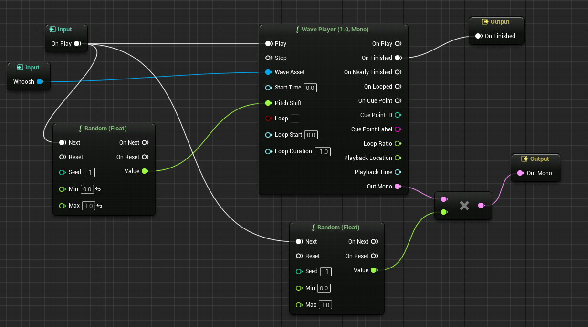

# debug printing
```
int e = Avg<int32>(1, 3);
UE_LOG(LogTemp, Warning, TEXT("Avg of 1 and 3: %d"), e);
```
# 61
EditAnywhere -> Details panel
Blueprint -> In the blueprint schematics
BlueprintPure -> Doesnt have an execution node, good for functions that dont require input (Getters are pure)

```
UPROPERTY(EditAnywhere, BlueprintReadWrite, Category = "Sine Parameters")
float Amplitude = 0.25f;

UPROPERTY(EditAnywhere, BlueprintReadWrite, Category = "Sine Parameters")
float TimeConstant = 5.f;

UPROPERTY(EditBlueprint, BlueprintReadWrite) 
float RotationRate = 0.25f;

UFUNCTION(BlueprintRead) 
float TransformedSin();

UFUNCTION(BlueprintPure)
float TransformedCos();
```

# 63
```
//To avoid including header files in the .h for pointers, use class
//Creates an incomplete type
class ACreature : public APawn{
	class UCapsuleComponent* Capsule;
};
```

# 66
//Passing a Bind Axis to a pawn
```
void ABird::SetupPlayerInputComponent(UInputComponent* PlayerInputComponent)
{
	Super::SetupPlayerInputComponent(PlayerInputComponent);
	PlayerInputComponent->BindAxis(FName("MoveForward"), this, &ABird::MoveForward);
}
```
## Enhanced input - Youtube Videos
Engine -> Input -> Default classes 
To add a module go to .Build.cs, to clean and reload the editor close editor, delete "Intermediate", "Saved" and "Binaries", 
right click on project "generate vs project files", rebuild "yes", open project and solution (there is also a refresh visual studio button in tools)


Old way (SetupPlayerInputComponent)
PlayerInputComponent->BindAxis(FName("MoveForward"), this, &ABird::MoveForward);

to view debug: showdebug enhancedinput

# 79 
```
//Declares the spring arm component and attaches it to the root component
CameraBoom = CreateDefaultSubobject < USpringArmComponent>(TEXT("CameraBoom"));
CameraBoom->SetupAttachment(GetRootComponent());
// Sets the length of the arm
CameraBoom->TargetArmLength = 300.f;

//Makes the Spring arm rorate with the Look() function
CameraBoom->bUsePawnControlRotation = true;

ViewCamera = CreateDefaultSubobject<UCameraComponent>(TEXT("ViewCamera"));
ViewCamera->SetupAttachment(CameraBoom);

//Stops the camera from rotating with the controller. Only the spring arm.
ViewCamera->bUsePawnControlRotation = false;
```

# 86 
- Using Enhanced input actions
- State machines for Animations


# 87
- Inverse Kinematics in Animations


# 90
Collisions: Physics and query in objects and pawns

For private variables, meta is needed to edit in blueprint:
```
UPROPERTY(VisibleAnywhere, BlueprintReadOnly, meta = (AllowPrivateAccess = "true"))
	float RunningTime;
```

# 92
Object Delegates

# 95
- `UFUNCTION()` macros need to be removed in inherited classes that overwrite the function
- Delegate functions are of `UFUNCTION()`

# 97 
Mixamo.com for animations
- Retargeting skeletal meshes 

# 100
inline keyword only works as a suggestion. Ue5 has FORCEINLINE

# 102 
Enum conventions
```
UENUM(BlueprintType)
enum class ECharacterState : uint8 {
	ECS_Unequipped UMETA(DisplayName = "Unequipped"),
	ECS_EquippedOneHandedWeapon UMETA(DisplayName = "Equipped One-Handed Weapon"),
	ECS_EquippedTwoHandedWeapon UMETA(DisplayName = "Equipped Two-Handed Weapon")
};
```

# 105 
Animation Graphs and simplifications
- Linked Anim Graph
- Blend Poses (Enum)

# 107
Animation Montages
- They have slots
- Slots can be added to ABPs to play 
- Notify when an attack ends and connect to a function

Good practices
- Refactor when possible
- Make const the var that are not changed

# 112
Adding sounds to animations
Sound cue


# 116
Making sockets on skeletal meshes
Cueing Animation notification to call cpp functions

# 119
- Edit/Tweak animations using keys 

# 123
Tracing 
World locations CPP: `GetComponentLocation()` Blueprints: `GetWorldLocation()`
Relative location: CPP: `GetRelativeLocation()`
FHitResult 

# 128 
How to use interfaces for Unreal

# 133 
Root motion animations